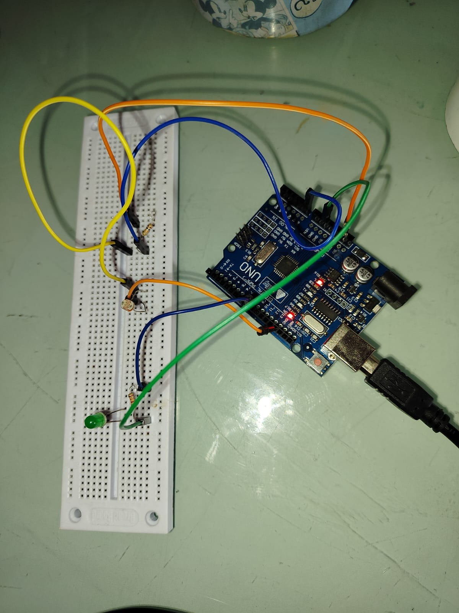
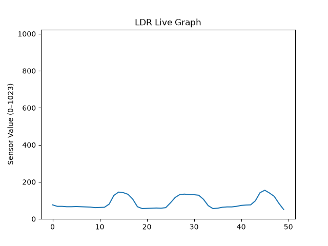

# Dark Sensor using Arduino and Python

A simple data acquisition project that uses an Arduino Uno and a Light-Dependent Resistor (LDR) to measure ambient light intensity. The sensor readings are transmitted to Python via serial communication, visualized in real time with Matplotlib, and logged to a CSV file for further analysis. 

---

## Objectives

The goals of this project were to:

- Interface an LDR with an Arduino Uno
- Acquire real-time sensor data
- Transfer data to Python through serial communication
- Visualize sensor readings live
- Store collected data for future analysis

---

## Project Overview

### Hardware Setup



### Live Sensor Graph



### Demo


---

## Features

- 📡 Reads real-time light intensity using an LDR and Arduino Uno
- 🔄 Transfers sensor data to Python via serial communication
- 📈 Displays a live graph using Matplotlib
- 💾 Saves sensor readings to a CSV file
- 📊 Exports the graph as a PNG image

---

## Components Used

### Hardware
- Arduino Uno
- LDR (Light Dependent Resistor)
- LED
- 220 Ω resistor
- 10 kΩ resistor
- Breadboard
- Jumper wires

### Software
- Arduino IDE
- Python 3
- PySerial
- Matplotlib
- CSV module

---

## How It Works

1. The Arduino continuously reads the analog value from the LDR.
2. The sensor readings are transmitted to the computer through serial communication.
3. A Python script reads the incoming data.
4. The data is plotted in real time using Matplotlib.
5. The readings are stored in a CSV file for future analysis.
6. When the program stops, the graph is saved as an image.

---

## Repository Structure

```
dark-sensor-arduino-python/
│
├── dark_sensor.ino      # Arduino code
├── dark_sensor.py       # Python script
├── dark_sensor.csv      # Sample logged data
├── dark_sensor.png      # Output graph
├── setup.jpg            # Hardware setup
├── demo.mp4             # Project demonstration
└── README.md
```

---

## Getting Started

### Hardware

- Connect the LDR and LED to the Arduino Uno as shown in the hardware setup image.
- Upload `dark_sensor.ino` using the Arduino IDE.

### Software

Install the required Python library:

```bash
pip install pyserial matplotlib
```

Run the Python script:

```bash
python dark_sensor.py
```

---

## Challenges and Debugging

Like most hardware projects, this one required several rounds of troubleshooting before everything worked reliably.

- Incorrect resistor placement initially prevented the LED from functioning.
- Loose breadboard connections caused unstable LDR readings.
- Serial communication between Arduino and Python required debugging due to inconsistent formatting.
- Real-time plotting initially flickered because of the way new data points were handled.
- Selecting an appropriate threshold for distinguishing light and dark conditions required experimentation.

Each issue improved my understanding of both electronics debugging and software integration.

---

## What I Learned

This project was my first experience combining electronics with Python for data acquisition.
Through building it, I learned:
- How voltage divider circuits enable analog sensing
- Interfacing Arduino with Python through serial communication
- Real-time data visualization using Matplotlib
- Logging experimental data into CSV files
- Systematically debugging hardware and software together
  
Most importantly, this project showed me how embedded electronics and data analysis can work together, something I hope to explore further in biomedical engineering and healthcare technology.

---

## Future Improvements

- Add a moving average filter for smoother visualization
- Save data with timestamps
- Build a real-time dashboard
- Extend the project to physiological sensors such as PPG

---

## Author

**Aadyaa Mehrotra**
